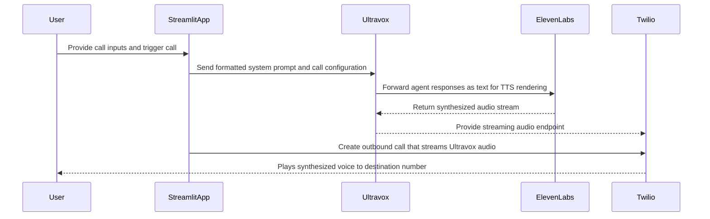

# Voice AI Dashboard

## Overview
Voice AI Dashboard is a Streamlit interface that lets operators configure and trigger outbound phone calls powered by Ultravox conversational AI, ElevenLabs text to speech, and Twilio voice streaming. Call templates are stored in `call_config.json`, while API credentials are loaded from `.streamlit/secrets.toml`. 

A hosted demo is available at https://voice-ai-dashboard-9fapwwnk9amveuzwawkucr.streamlit.app/.

## Prerequisites
1. Install Python 3.9 or newer.
2. Populate `.streamlit/secrets.toml` with valid `TWILIO_ACCOUNT_SID`, `TWILIO_AUTH_TOKEN`, `ULTRAVOX_API_KEY`, `ELEVENLABS_API_KEY`, and optionally override `ULTRAVOX_API_URL`.
3. Install dependencies from the project root: `pip install -r requirements.txt`.

## Running the App
1. From the `Voice-AI-Dashboard` directory run `streamlit run app.py`.
2. Open the provided local URL in a browser.

## Using the Interface
1. Select a use case. Each use case defines customer defaults, the system prompt, and call settings.
2. Review the read only Twilio phone number shown under Call Configuration. All calls originate from this number.
3. Enter or adjust the destination phone number, customer name, gender, and any custom parameters you want to inject into the prompt.
4. Press Initiate Call. The app validates required credentials, formats the Ultravox prompt with the provided data, and triggers the call.
5. After a call completes you can expand entries in Call History to review metadata and transcripts.

## Configuration Tips
1. Update `call_config.json` to add new use cases, tweak prompts, or change voice settings. The app automatically loads the default use case specified in the file.
2. Store sensitive data only in `.streamlit/secrets.toml`. The UI confirms whether all required secrets are present before allowing a call.
3. The voice provider, model, and Twilio number are intentionally read only in the UI to keep the workflow safe for operators. Modify them in `call_config.json` if needed.

## Voice Pipeline

## Troubleshooting
1. Missing credentials: check the Configuration Status section or inspect `.streamlit/secrets.toml`.
2. API errors: look for error alerts after pressing Initiate Call; the message contains the upstream response.
3. Dependency issues: ensure the same interpreter used for `pip install` runs Streamlit, and reinstall requirements if modules are missing.

